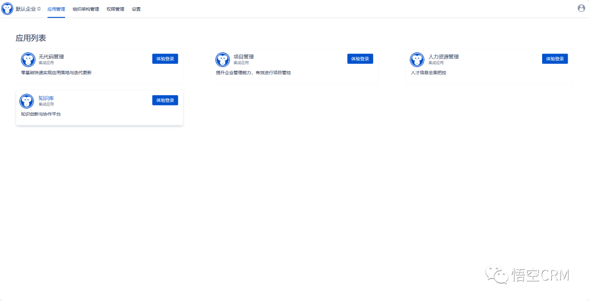
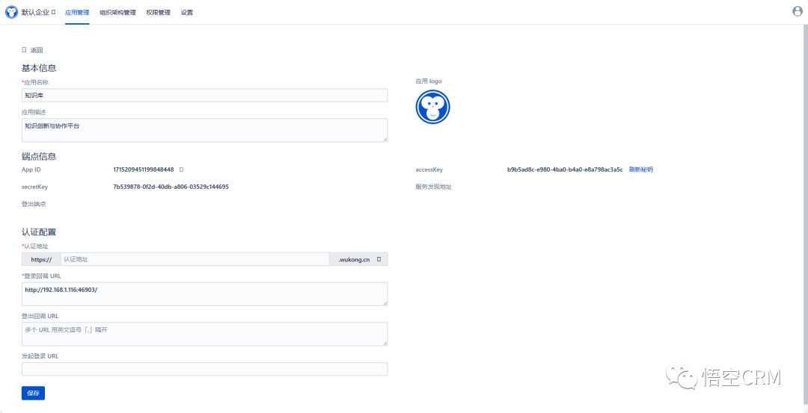
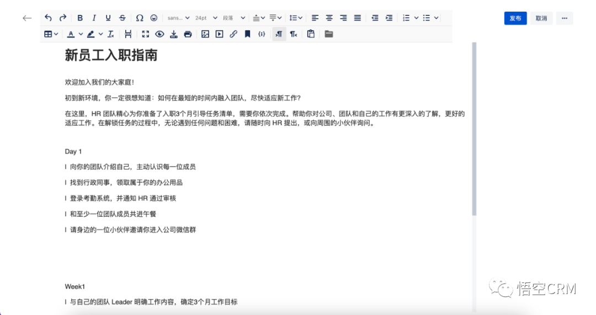
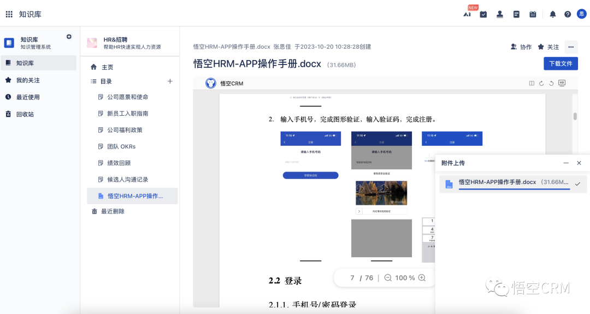
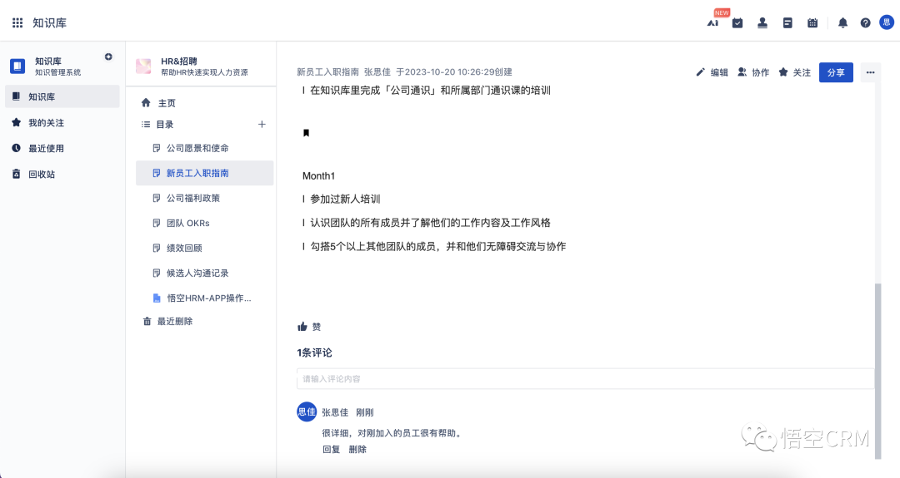
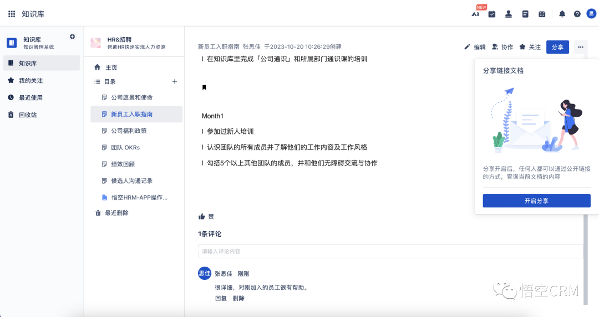
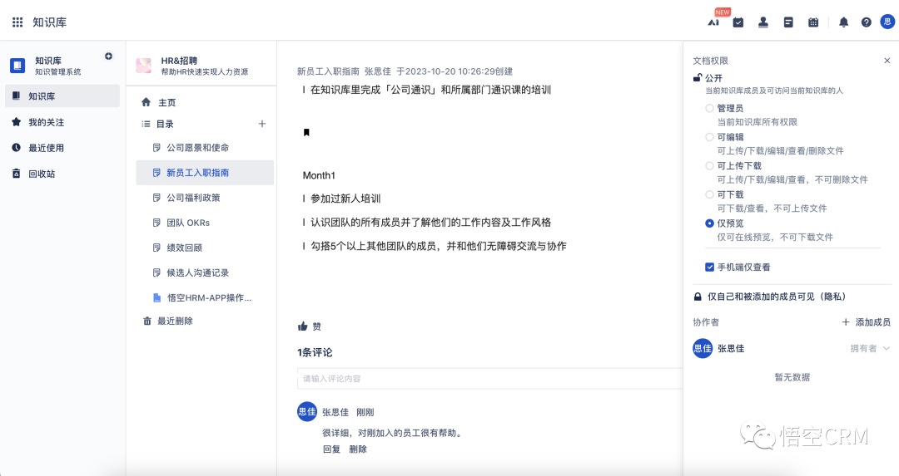

# Wukong_KnowledgeBase

### 🌐Read This in [Chinese](README.md)

Experience Address: [https://www.72crm.com](http://www.72crm.com)

## Introduction to Wukong Knowledge Base Management

The Wukong Knowledge Base Management System is officially open source. Starting from the perspective of knowledge base management, it centralizes data to gather almost all information related to the knowledge base. You can create pages through the Wukong CRM knowledge base, and you can choose templates in addition to using a blank document. Templates are based on blank documents, with some document elements added according to specific needs, helping users create documents better and faster.

Wukong Knowledge Base comes with a large number of templates, assisting in various aspects of project work, including product requirements, meeting records, decision-making records, instruction manuals (How-to), review records, work plans, task reports, and so on. With the knowledge base, you can create your own wiki and collaborate with your team.

Official Website Address: [http://www.5kcrm.com](http://www.5kcrm.com/)

Scan the QR code to add Wukong official customer service WeChat, and you are invited to join the thousand-people WeChat exchange group:


Follow the Wukong CRM public account to learn more about Wukong information:


Scan the QR code to join the WeChat group, online customer service to answer questions:


:boom:  :boom:  :boom: Note: The Wukong Knowledge Base Management System adopts a new front-end and back-end separation mode. The code in this repository has integrated the front-end Vue packaged files, **eliminating the need for packaging operations, no need to run the front-end**

# Wukong Knowledge Base Directory Structure

``` lua
wk_open_km
├── common        -- Basic module
├── DB        -- SQL files
├── km        -- Knowledge Base Management Module
├── ux        -- Front-end source code
```

# Core Functional Modules

**Knowledge base creation, supports various template knowledge base creations** <br/>
**Online editing, supports document online editing** <br/>
**Knowledge base comments, supports commenting on articles** <br/>
**Knowledge sharing, supports generating external links for sharing** <br/>
**Global search, supports content retrieval** <br/>

# Main Technology Stack Used in Wukong Knowledge Base Management

# Backend:

|Name                   | Version                | Description  |
|-----------------------|------------------------|--------------|
| spring-cloud-alibaba  | 2021.0.5.0             | Core Framework |
| spring-boot           | 2.7.15                 | Spring version |
| mybatis-plus          | 3.5.3.2                | ORM Framework |

# Frontend:

| Technology | Description | Version |
|------------|-------------|---------|
| [Vue](https://vuejs.org) | Framework | 2.5.17 |
| [Vue-router](https://router.vuejs.org) | Routing Framework | 3.0.1 |
| [Vuex](https://vuex.vuejs.org) | Global State Management Framework | 3.0.1 |
| [Element](https://element.eleme.io) | UI Framework | 2.12.0 |
| [Axios](https://github.com/axios/axios) | HTTP Framework | 0.18.0 |

# Instructions for Use

### I. Installation of this project needs to be carried out in a Linux environment, and the Linux environment can be installed in a virtual machine.

Linux environment configuration requirements are as follows:

Recommended Operating System: CentOS
System Memory: ≥16G
System CPU: ≥4 cores
Disk Size: ≥100G

### II. Pre-installation environment, the following configurations need to be installed in the Linux environment

- Jdk1.8
- Maven3.5^
- Mysql8^
- Redis (version not limited)
- Elasticsearch 8.5.3

### Installation Instructions

#### I. Installation of Dependency Environment

###### 1. Install jdk

```
yum -y install java-1.8.0-openjdk-devel;
```

###### 2. Install redis

```
yum -y install epel-release;
yum -y install redis;
systemctl start redis

#-- Modify the redis password to 123456
yum -y install vim;
vim /etc/redis.conf;

#-- Add a line at the end of the file
requirepass 123456
#-- Or enter / to search # requirepass foobared
#-- Remove the # in front and change foobared to 123456
#-- After modifying, :wq to save and exit, restart redis

systemctl restart redis
```

###### 3. Install mysql

```
wget https://repo.mysql.com//mysql80-community-release-el7-3.noarch.rpm
yum -y install mysql80-community-release-el7-3.noarch.rpm
yum -y install mysql-community-server --nogpgcheck
sudo systemctl start mysqld.service;
sudo systemctl enable mysqld.service;

-- Check the default password of the installed mysql
grep "password" /var/log/mysqld.log
-- Enter mysql, e.g.: mysql -u root -p"GXOO%eiI/7o>"
mysql -u root -p"your default password from the previous step"

-- Modify mysql password as shown below
set global validate_password_policy=LOW;
ALTER USER 'root'@'localhost' IDENTIFIED BY 'password';

-- Exit mysql
exit
    
-- Modify mysql configuration
vim /etc/my.cnf;
-- Enter editing mode by typing i, modify the sql_mode settings, copy the sql_mode configuration below, and paste it under [mysqld] using shift+insert
sql_mode=STRICT_TRANS_TABLES,NO_ZERO_IN_DATE,NO_ZERO_DATE,ERROR_FOR_DIVISION_BY_ZERO,NO_ENGINE_SUBSTITUTION 
-- After modification, press esc, then :wq to save and exit, restart mysql

service mysqld restart;
```

### 4. Install elasticsearch (es)

```
-- Download es  

# Be careful not to put it in the root directory

useradd elasticsearch
wget https://artifacts.elastic.co/downloads/elasticsearch/elasticsearch-8.5.3-linux-x86_64.tar.gz
tar xvf elasticsearch-8.5.3-linux-x86_64.tar.gz
chown -R elasticsearch:elasticsearch  elasticsearch-8.5.3 
chmod -R 777  elasticsearch-8.5.3

-- Modify es configuration file: elasticsearch.yml

# If the installation of es has the following configuration information, you need to modify it

ingest.geoip.downloader.enabled: false  ## Add configuration
xpack.security.enabled: true
xpack.security.enrollment.enabled: true

```
#### II. Project Configuration and Startup

###### 1. Install Maven
```bash
yum -y install maven
```

###### 2. Import Database from DB Directory

###### 3. Execute `mvn install` in the Project Root Directory
###### 4. Modify Configuration Information
###### 5. Configure Database Account Information and Redis Account Information in the `resource` Directory Under the `km` Module

###### 6. Obtain an Account at [Wukong ID](https://id.72crm.com/)
After registering, click on "Default Enterprise" and select "Knowledge Base Management" from the application list.

Click on "Knowledge Base Management"


Copy the App ID, accessKey, and secretKey to `km-web\src\main\resources\application.yml`, corresponding to appId, clientId, and clientSecret as shown below.

Copy the appId to `km-web\src\main\resources\static\APPLICATION_ID.txt`, replacing the content inside.


###### 7. Package and Deploy the Project
```bash
--Package the project
mkdir /opt/package
mvn clean -Dmaven.test.skip=true package
cp km-web/target/km-web.zip /opt/package
cd /opt/package
unzip km-web.zip -d km
cd km
sh 72crm.sh start
```

###### 8. Run and Package the Frontend Project
```bash
- Download and install Node.js (LTS): https://nodejs.org/
- This project is a front-end/back-end separation project. To access it locally, you need to set up a back-end environment, please refer to [Backend Project](https://gitee.com/wukongcrm/crm_pro);
- To access the online interface, there is no need to set up a back-end environment, just change the target in proxyTable under dev in the config/index.js file to the online address;
- Run npm install to download related dependencies;
- Run npm run dev to start the project;
- Upon successful execution, you can visit http://localhost:8090 to view the project.

Packaging:
- Adjust the BASE_API in config/prod.env.js to your needs
- Run npm run build
- Packaging complete
```

### III. Additional Information

#### 1. API Documentation
```
API Documentation Address: http://localhost:44315/doc.html
```

#### 2. Docker Image
```
Stay tuned
```

### IV. Wukong Knowledge Base Feature Module Preview








